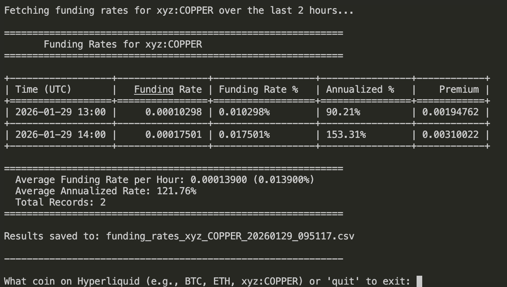
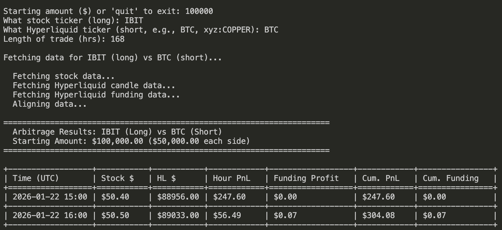
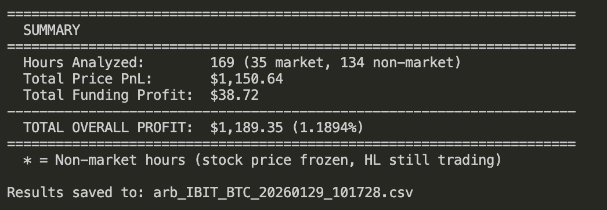

# Hyperliquid Funding Rate Tracker

Tool I built to track funding rates on Hyperliquid and backtest arb strategies. Cross refrences trad stocks against Hyperliquid perps. Calcualtes, backtests PNL hourly. 

## Scripts

### `fundingrate.py`
Pulls historical funding rates for any coin on Hyperliquid. Shows hourly rates, annualized %, and averages. 



### `spotstockarb.py`
Backtests a delta-neutral arb: long a stock/ETF, short the corresponding Hyperliquid perp. Calculates PnL from both price movement and funding payments. Hourly, accounts for 24-hr trading on HL vs public hours for NYSE. 




## Setup

```bash
pip install requests yfinance tabulate
```

## Usage

```bash
python fundingrate.py
python spotstockarb.py
```

CSV outputs get saved to the `output/` folder.

## Why

Funding rates on perps can be insane. If you can hedge with the underlying asset, you pocket the funding. This helps figure out if it's worth it.
